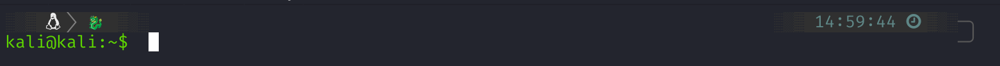
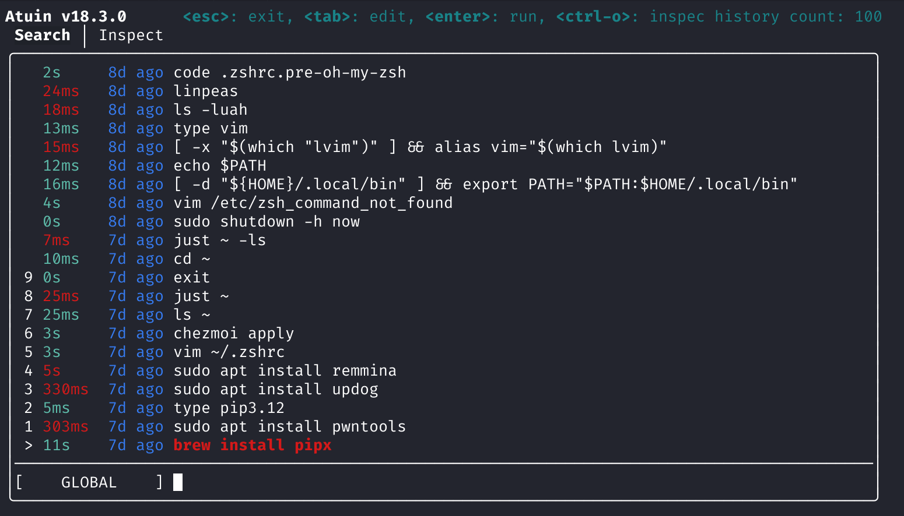

# Mon Épée

As this repo uses Chezmoi, I decided to call this: `Mon Épée`. The idea behind this repo is to provide a way to achieve familiar and replicable environment for Kali users.

This project uses chezmoi to manage dotfiles and an Ansible playbook to install packages aiming for idempotence.

## Install

To install this, we need to install `chezmoi`

```
cd /usr/local
sudo sh -c "$(curl -fsLS get.chezmoi.io)"
```
> Installing chezmoi

The previous commands  will install chezmoi in __/usr/local/bin/chezmoi__

After that, we can proceed to run the following command to install everything:

```bash
chezmoi init --apply https://github.com/0xjams/monepee
```
> Setting up our dotfiles

Here's also a oneliner to get it running

```bash
sudo apt install curl && sh -c "$(curl -fsLS https://raw.githubusercontent.com/0xjams/monepee/main/install_linux.sh)"
```
> Using a oneliner in Linux

For testing, we can also use other branches, for instance:

```bash
sudo apt install curl && bash <(curl -Ss  https://raw.githubusercontent.com/0xjams/monepee/main/install_linux.sh) dev
```

During the installation, we'll be prompted for our GitHub user. This is to pull our public keys from there to place them in `~/.ssh/authorized_keys`. If we don't want that, we can just tap enter without entering anything.

## Batteries Included in Kali

When used in Kali, this repo includes packages from various sources depending on the host's architecture.

On x86_64 hosts it has packages from Kali repos, Homebrew, and pipx.
On arm hosts it has packages from Kali repos, Nix, and pipx.

Ideally, using all the repos the intention is to have the same applications available. Homebrew is not available for arm, so that's why in that case some packages come from Nix in that case. To change or add packages to any of the sources, we can fork this repo and modify _.chezmoidata.json_ before installing it.

### Packages from Kali

The following packages are installed using `apt`.

```
- autorecon
- peass
- remmina
- flameshot
```

### Packages from Homebrew (x86_64 only)

The following packages are installed using `brew`.

```
- tmux
- git
- nvim 
- atuin
- lsd
- zoxide
- bat
- fzf
- imagemagick
- node@20 
- python
- make
- lazygit
- rbw
- just
- pipx
```

### Packages from Nix (ARM only)

The following packages are installed using `nix env`.

```
- atuin
- lsd
- zoxide
- ripgrep
- bat
- rbw
- just
- neovim
- cargo
- nodejs_20
- imagemagick
- lazygit
```

### Packages from Pipx

```
- updog
- pwntools
- impacket
```

### Text Editor

Although `nvim` gets installed either from Nix or Brew, this configuration also includes a distro called [_Lunar Vim_](https://www.lunarvim.org/).

### NerdFont

There's an Ansible Task that automatically downloads JetBrains Mono NF to the _~/.fonts_ directory.

### Customization

As Kali uses _zsh_, this configuration includes a few upgrades for that. Particularly [_Oh My Zsh_](https://ohmyz.sh/) and [_Powerlevel10k_](https://github.com/romkatv/powerlevel10k). 

There's also syntax highlighting and a few other details that can be added or removed from _.chezmoiexternal.toml_ before installing this.

### Look and Feel

The shell is customized with a few plugins that can be modified in _.zshrc_ as needed.



After installing it, we also have `atuin` available. This has many benefits, including syncing our history among computers. However, by default after installing this we only get the nice search interface and the fact that our history is sent to a local SQLite database.

If we tap the _up_ arrow key, this is how the search should look like.



If synchronization and other Atuin are needed, we can check their [documentation](https://docs.atuin.sh/) and apply the configuration changes to achieve this.

## Customizing Things

Ideally, this configuration aims to be _idempotent_, so if we run the playbook more than once, we should achieve the same results.

To modify configuration files (for instance _.zshrc_), we can run `chezmoi cd` to enter the repo, then modify any file in the context of the repo.

After that, we can save our changes and commit them. 

It's important to note that modifying files ther is not enough, after we modify anything we need to run `chezmoi apply`. And only then our actual dotfiles (not just the source) are modified.

If we ever need to run the ansible playbook again, we can do so by running `ansible-playbook -i 127.0.0.1, ~/.bootstrap/setup.yml --ask-become-pass`.


